# PathoConnect

A laboratory information management system (LIMS) for pathology labs — patient records, configurable report templates, a technician → doctor sign-off workflow with tamper-evident digital signatures, PDF generation, and email delivery.

**Stack:** React + Vite + TypeScript + Tailwind (frontend) · Node.js + Express + MongoDB (backend) · Puppeteer (PDF rendering)

---

## Screenshots

### Create a report

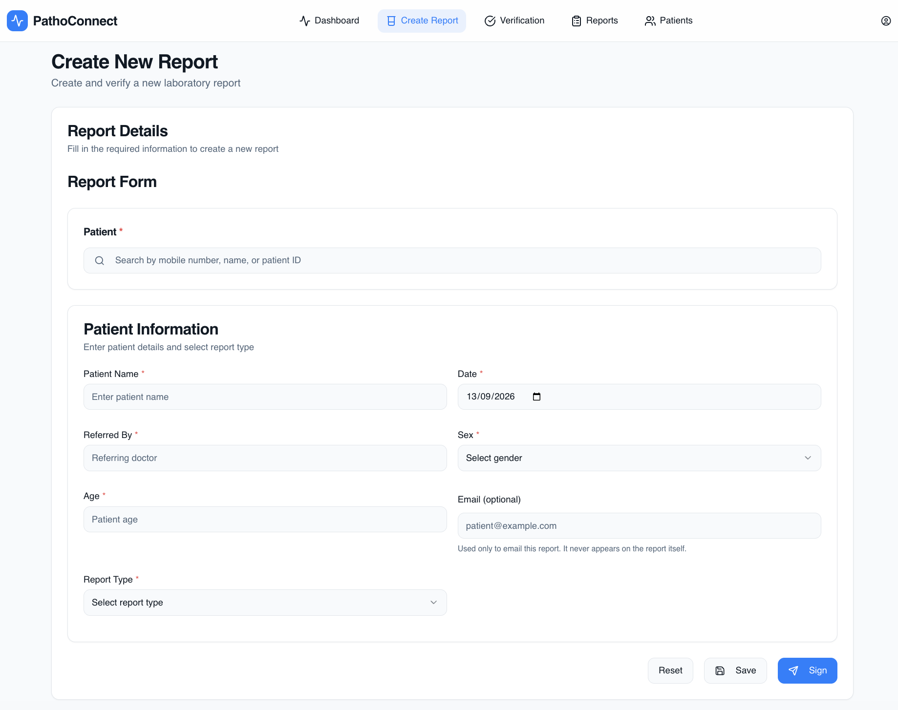

Search for a patient, fill in the report, and pick from the lab's configured report types.

### Doctor reviews and signs

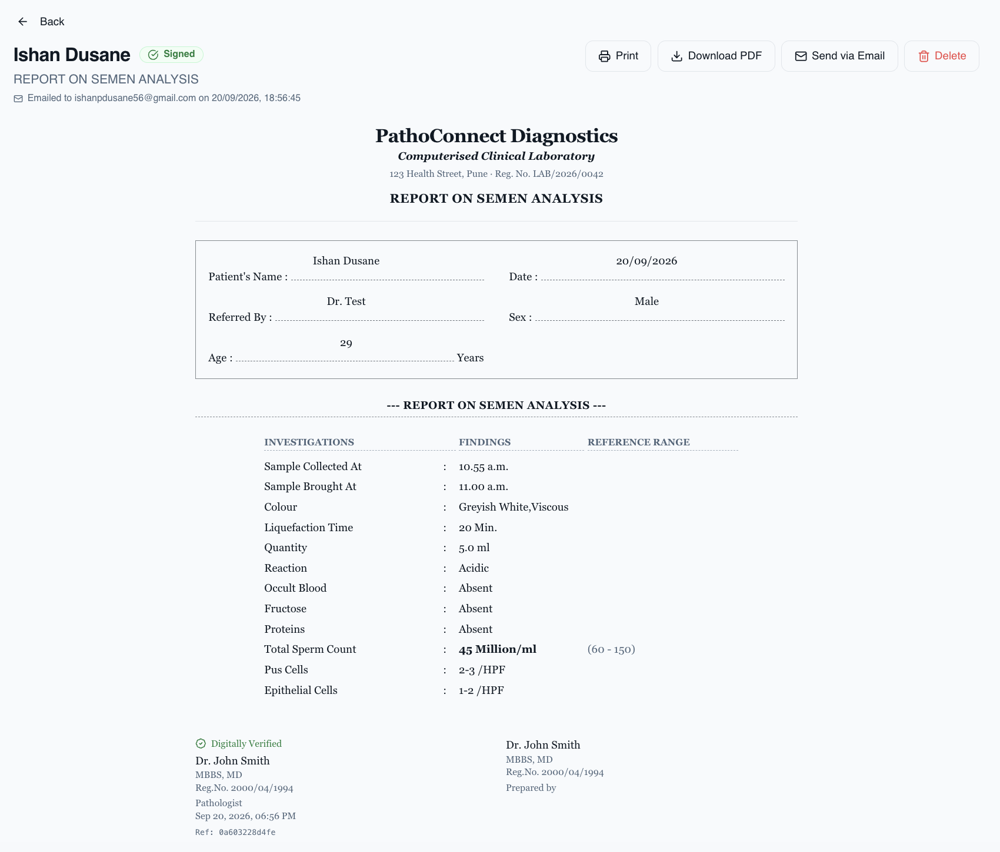

Once signed, the report is locked and stamped with a digital signature block. Values outside the configured normal range (like Total Sperm Count above) render in **bold** automatically. The pathologist's and preparer's signatures sit side by side, and every report gets a short signature reference (`Ref:`) for verification.

### Send it, combined into one PDF

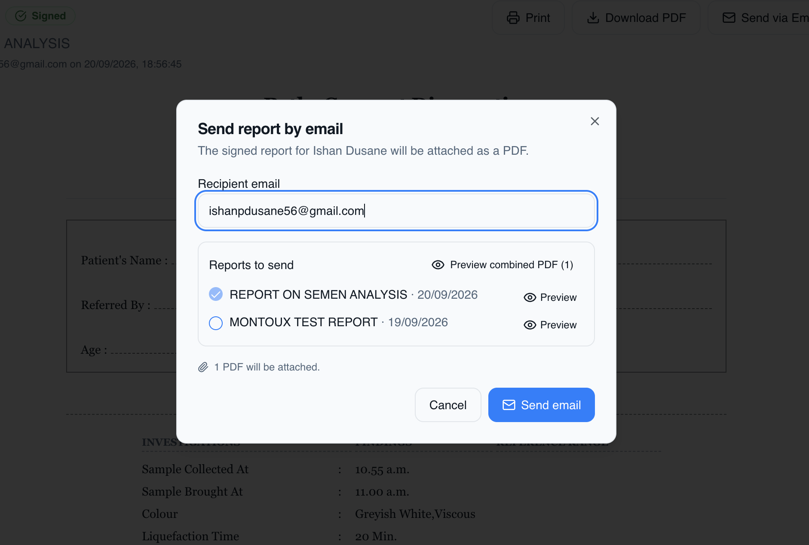
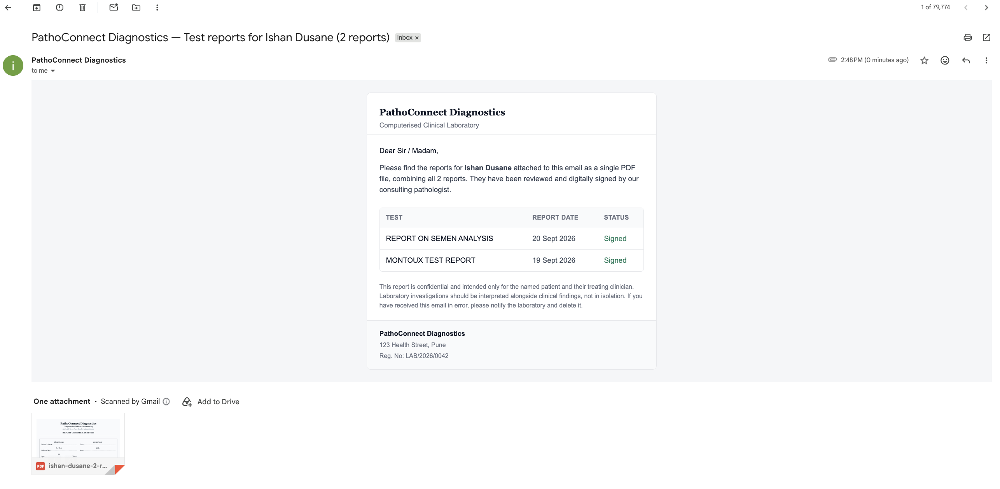

Selecting multiple reports for the same patient sends them as **one merged PDF**, not several separate attachments.

### Dashboard

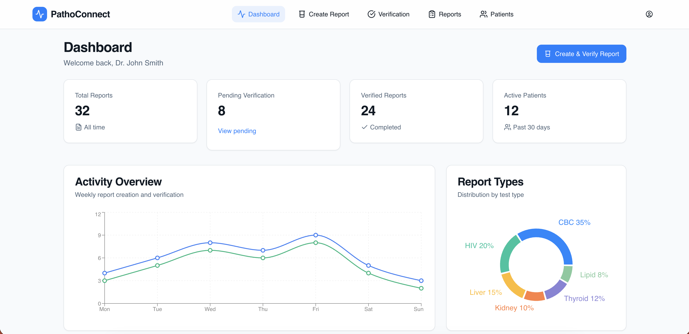

At-a-glance report volume, pending-verification queue, and a breakdown by test type.

### Reports, filterable and paginated

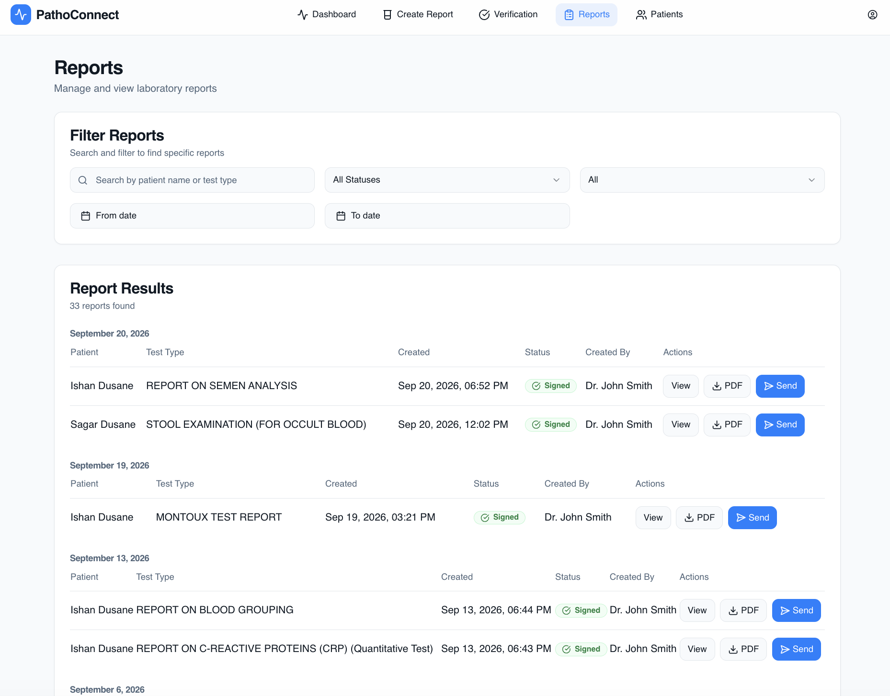

### Patients

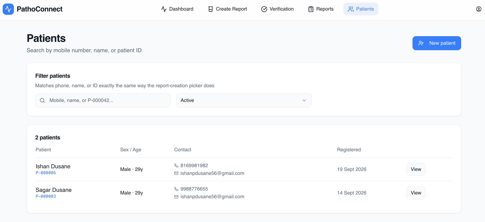

Search by phone, name, or patient ID; the system flags likely duplicate patients before you create a new record.

### Admin — report templates

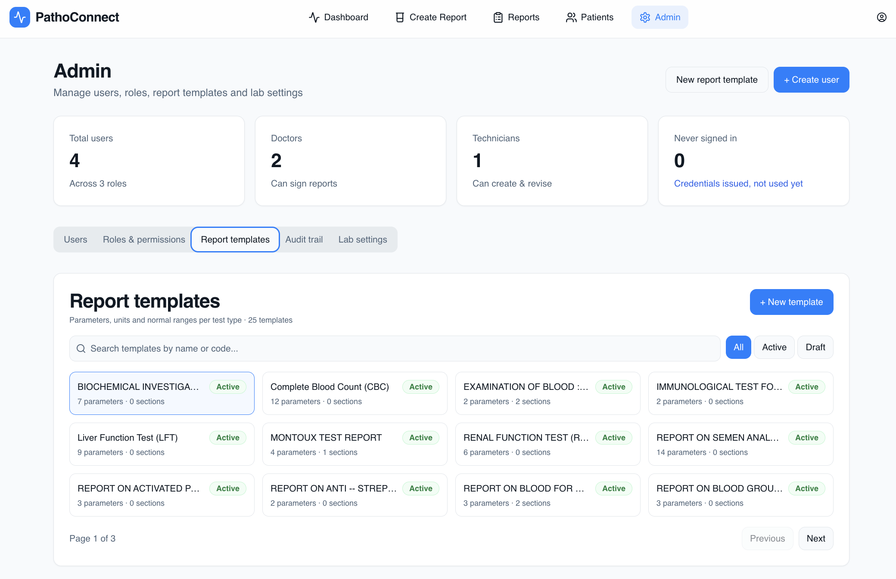
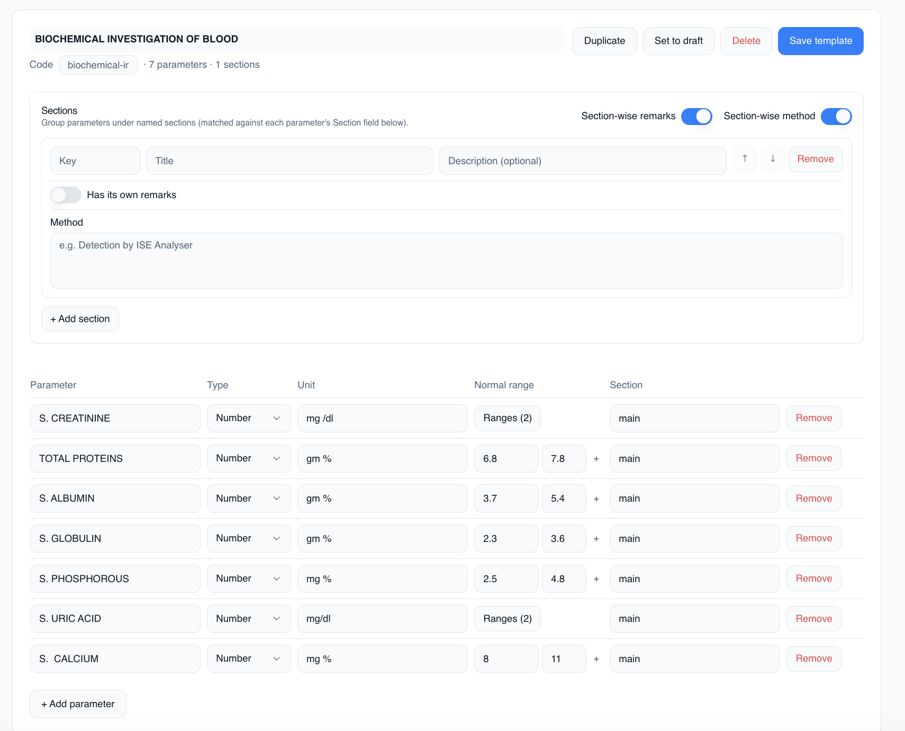

Every report type is built from named sections and typed parameters, each with its own unit and gender/age-banded normal range.

### Admin — users and roles

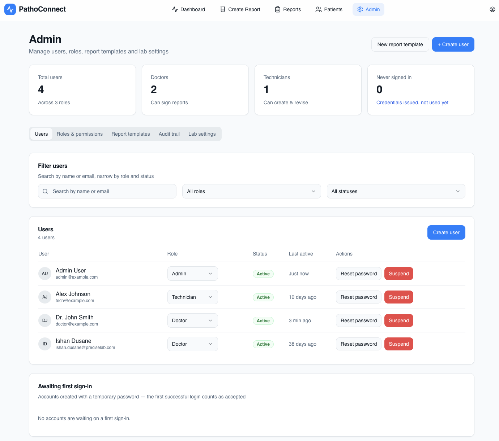
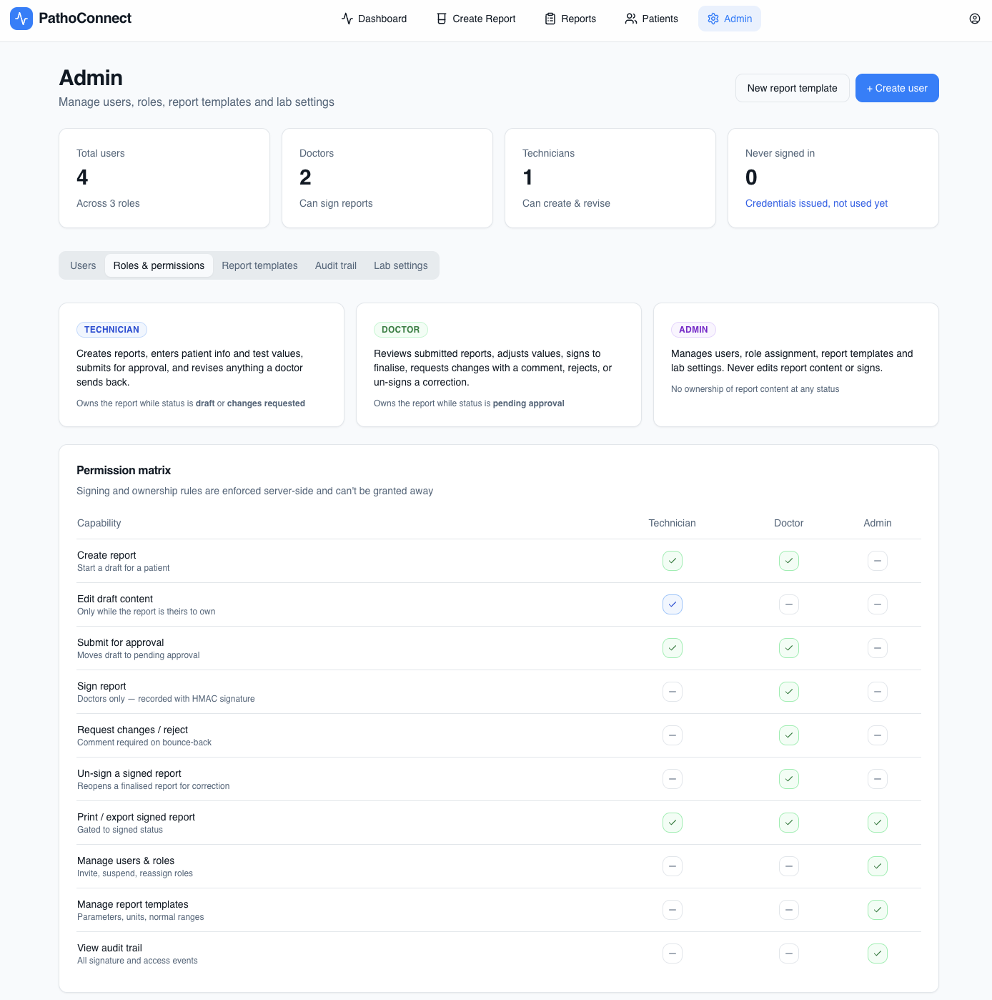

Signing and content-ownership rules are enforced server-side — an Admin can manage accounts and templates but can't edit or sign report content at any status.

---

## Features

### Patients
- Search by phone, name, or patient ID
- Duplicate-patient detection with a merge flow, so the same person doesn't end up as two records
- Validated date of birth (real calendar dates only), 10-digit phone, and email format

### Report templates (Admin)
- Parameter types: number, text, select, range, boolean, rich-text paragraph, **dated readings** (the same measurement recorded again on different dates, e.g. a Mantoux test's Day 1/2/3), and **breakdown** (one field with a fixed set of named sub-values, e.g. sperm motility broken into Actively/Sluggishly/Non-Motile)
- Normal ranges banded by gender and age, with a dedicated multi-range editor for parameters that need more than one band
- Named sections with their own optional remarks and method text
- Blank/duplicate parameter (and sub-field) names are rejected at save time — the report-fill form and the signature hash both key values by name, so this is caught before it can silently corrupt data
- Draft vs. active templates, template duplication

### Report workflow & digital signing
- Status flow: `draft → pendingApproval → signed`, with `changesRequested`/`rejected` as the doctor's decline paths
- A technician owns a report while it's in draft/changes-requested; a doctor owns it while pending approval, and only a doctor can sign, request changes, reject, or un-sign
- Signing computes a canonical content hash (patient info, every parameter's name/value/unit, remarks) and HMAC-signs it — any later edit or tamper is detectable, and a lab-wide re-verification check exists to confirm every signature still matches its content
- Values outside a parameter's configured normal range render in bold automatically in the final report

### PDF & email
- Server-side PDF rendering (Puppeteer) of the exact same view used on screen, so there's no drift between what's shown and what's printed/emailed
- Sending multiple reports for one patient merges them into a single PDF attachment instead of one email per report
- Delivery history recorded per report (who sent it, when, to whom, success/failure)

### Dashboard & reporting
- Report volume, pending-verification count, and active-patient stats
- Weekly activity chart and a breakdown of reports by type
- Reports list: paginated, filterable by patient, status, report type, and date range

### Admin
- User management: create accounts, assign roles, reset passwords, suspend access, track who hasn't logged in yet
- A capability matrix makes the Technician/Doctor/Admin permission boundaries explicit in the UI, not just enforced silently server-side
- Full audit trail of template/user/report actions
- Lab settings: letterhead, registration number, and address shown on every report

### Security
- Every rich-text field (remarks, paragraph/dated-reading/breakdown values) is sanitized server-side against an explicit tag allow-list before storage
- Report content is signed with HMAC-SHA256, not just a stored "signed" flag — a modified report fails re-verification
- A patient's snapshot on a signed report (`patientInfo`) is immutable and separate from the mutable link to their live patient record, so correcting a typo in a patient's contact details can never retroactively invalidate a doctor's signature

---

## Project structure

```
.
├── src/            # React frontend (Vite, TypeScript, Tailwind, shadcn/ui)
├── api/            # Express backend + MongoDB models
│   ├── models/     # Mongoose schemas (Report, ReportType, Patient, User, AuditLog, LabSettings)
│   ├── routes/     # REST endpoints
│   ├── middleware/ # Auth + report-access guards
│   └── utils/      # PDF rendering, email, signature hashing/HMAC, sanitization
└── docs/           # This README's screenshots
```

## Setup

### Backend

```bash
cd api
npm install
cp .env.example .env   # then fill in MONGODB_URI, JWT_SECRET, SIGNING_SECRET, SMTP_*
npm run dev
```

MongoDB must be running and reachable at `MONGODB_URI`. To seed an initial admin account and demo data:

```bash
node seed-admin.js   # creates admin@example.com — change the password after first login
node seed.js         # optional: demo doctor/technician accounts + sample report types
```

### Frontend

```bash
npm install
npm run dev
```

The frontend expects the API at `http://localhost:5001/api` by default (`VITE_API_URL` to override) and serves on `http://localhost:8080`.

## API overview

| Route group | Purpose |
|---|---|
| `/api/auth` | Login, current-user info, force-change-password |
| `/api/patients` | Patient search/CRUD, duplicate detection, merge |
| `/api/report-types` | Report template CRUD (Admin), including sections and parameters |
| `/api/reports` | Report CRUD, submit/sign/request-changes/reject/un-sign, PDF export, email send |
| `/api/users` | User management (Admin) |
| `/api/lab-settings` | Letterhead/lab configuration, signature re-verification |
| `/api/audit` | Audit log |
